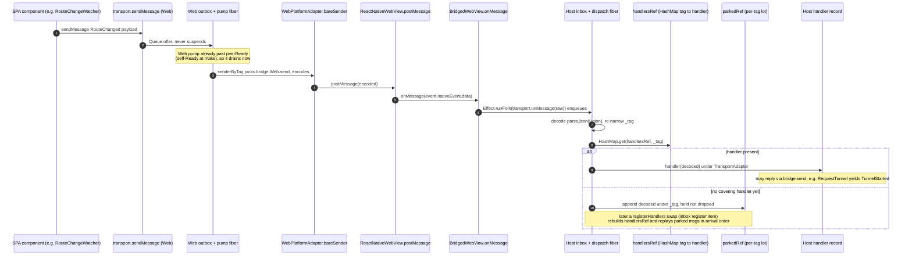
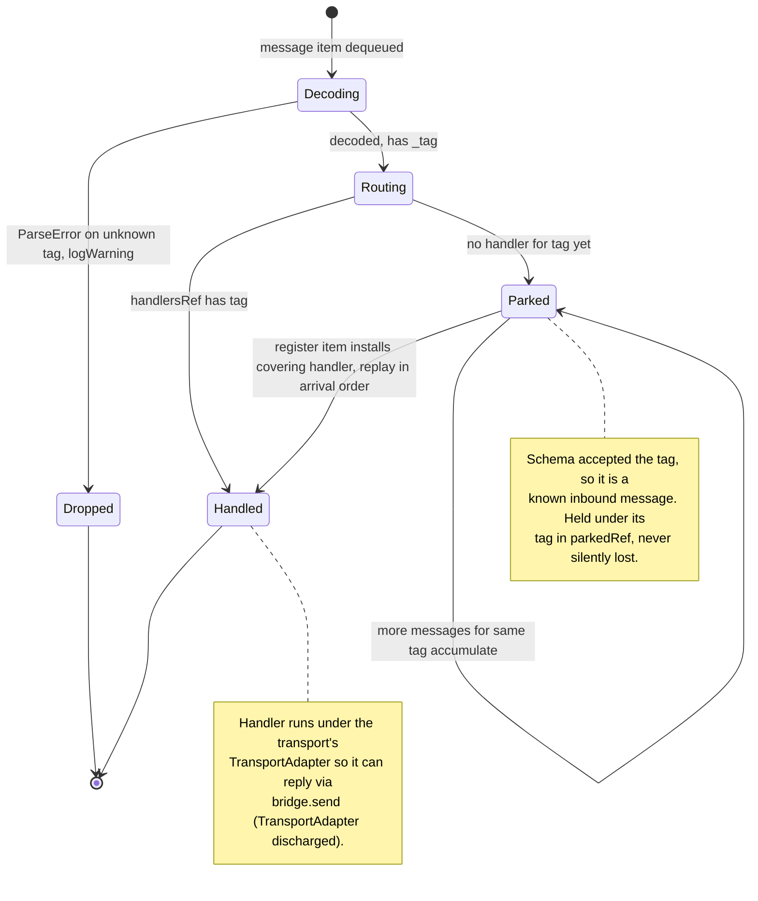
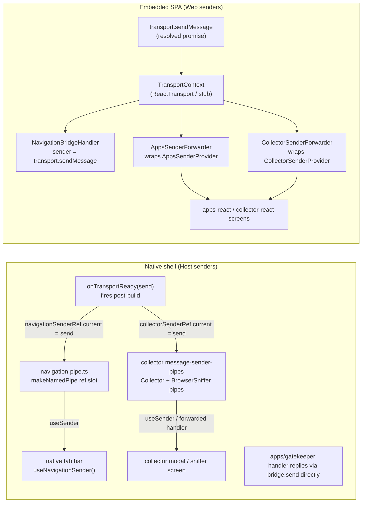

# Cross-process WebView bridge transport — component map

A map of the reworked `effect-messaging` transport: how the packages,
modules, and runtime queues relate, and how a message travels in each
direction. Drawn from reading the source — concrete files/symbols are
named under each diagram so you can jump from a node to the code.

The system spans four layers, strictly bottom-up:

1. **Core** — `global/effect-messaging/effect-messaging-core` (pure, platform-neutral).
2. **Platform adapters** — `effect-messaging-react` (web/page side) and `effect-messaging-expo` (native host side).
3. **Slice bridges + host bindings** — `slices/{navigation,gatekeeper,apps,collector,browser-sniffer}/*`.
4. **App wiring** — `apps/wildflower-react` (the embedded SPA) and `apps/wildflower-expo` (the native shell).

There are two live transports per running system: one host transport
(`makeHostTransport`) in the Expo shell and one web transport
(`makeWebTransport`) in the SPA.
They talk over a single `react-native-webview` `postMessage` channel
(plus the boot-time URL-param channel for host→web seeds).

---

## Diagram 1 — Package / module dependency graph

What this shows: every module in the transport and who imports whom.
Edges point from importer to imported (i.e. "depends on"). Layering is
respected: `-core` has no inbound edges from adapters; adapters depend on
core; slices depend on core (+ their platform adapter); apps depend on
everything. The two app columns (web SPA vs. native shell) only meet at
the wire, never in code.

```mermaid
graph TD
  %% ---------- CORE ----------
  subgraph CORE["effect-messaging-core (pure)"]
    bridge["bridge.ts<br/>Bridge.make, Half, AnyBridge,<br/>HalfHandlers, HandlersByBridge,<br/>SendableMessage"]
    msg["message.ts<br/>SchemaRecord, ValidatedPairs"]
    msgh["message-handler.ts<br/>HandlersFor"]
    transport["bridge-transport.ts<br/>makeHostTransport / makeWebTransport<br/>outbox + inbox + 2 fibers<br/>peerReady / __Ready"]
    adapter["transport-adapter.ts<br/>TransportAdapter Tag"]
    bare["bare-sender.ts<br/>BareSender(Function/Service)"]
    hostb["host-bindings.ts<br/>HostBindings single/combine/<br/>callTransportReady"]
    lookups["internal/bridge-lookups.ts<br/>senderByTag, findUrlParamSchema"]
    urlp["url-param-message.ts<br/>append/reEncode/strip"]
    log["logging.ts<br/>LogBridge, installConsoleInterceptor,<br/>defaultLogHostHandlers"]
    testpa["test-platform-adapter-layer.ts"]
  end

  bridge --> msg
  bridge --> msgh
  bridge --> adapter
  transport --> bridge
  transport --> adapter
  transport --> lookups
  msgh --> msg
  msgh --> adapter
  hostb --> bridge
  hostb --> transport
  lookups --> bridge
  lookups --> msg
  urlp --> bridge
  urlp --> lookups
  log --> bridge
  adapter --> bare
  testpa --> adapter
  testpa --> bare

  %% ---------- ADAPTERS ----------
  subgraph REACT["effect-messaging-react (page side)"]
    webpa["web-platform-adapter.ts<br/>bareSender/drainInitial/attachBareSender"]
    pipe["make-named-pipe.tsx<br/>makeNamedPipe (sender ref slot)"]
    disp["make-bridge-dispatcher.tsx<br/>makeBridgeDispatcher (handler fan-out)"]
  end
  webpa --> adapter
  webpa --> bare
  webpa --> bridge
  webpa --> urlp
  pipe --> transport
  pipe --> bridge
  disp --> transport
  disp --> bridge

  subgraph EXPO["effect-messaging-expo (native host side)"]
    bwv["bridged-webview.tsx<br/>BridgedWebView (builds Host transport)"]
    twv["transport-webview.tsx<br/>TransportWebView (owns WebView ref)"]
    ulhb["use-log-host-binding.ts"]
  end
  bwv --> transport
  bwv --> hostb
  bwv --> adapter
  bwv --> bare
  bwv --> urlp
  bwv --> twv
  ulhb --> hostb
  ulhb --> log

  %% ---------- SLICE BRIDGES (core) ----------
  subgraph SLICEC["slice -core bridges"]
    navb["navigation-core<br/>NavigationBridge"]
    gkb["gatekeeper-core<br/>GatekeeperBridge"]
    appb["apps-core<br/>AppsBridge"]
    colb["collector-fundamentals<br/>CollectorBridge"]
    bsb["browser-sniffer-core<br/>BrowserSnifferBridge"]
  end
  navb --> bridge
  navb --> urlp
  gkb --> bridge
  gkb --> urlp
  appb --> bridge
  colb --> bridge
  colb --> bsb
  bsb --> bridge

  %% ---------- SLICE ADAPTERS ----------
  subgraph SLICEA["slice -react / -expo handlers + bindings"]
    navweb["navigation-react<br/>makeNavigationWebHandlers<br/>NavigationBridgeHandler"]
    navexpo["navigation-expo<br/>makeNavigationHostHandlers<br/>useNavigationHostBinding"]
    gkweb["gatekeeper-react<br/>gatekeeperWebHandlers"]
    gkexpo["gatekeeper-expo<br/>useGatekeeperHostBinding"]
    appweb["apps-react<br/>appsWebHandlers"]
    appexpo["apps-expo<br/>makeAppsHostHandlers<br/>useAppsHostBinding"]
    colweb["collector-react<br/>collectorWebHandlers<br/>activeHandlerRef"]
    colexpo["collector-expo<br/>useCollectorHostHandlers<br/>useCollectorHostBinding<br/>message-sender-pipes"]
  end
  navexpo --> navb
  navexpo --> hostb
  navweb --> navb
  gkexpo --> gkb
  gkexpo --> hostb
  gkweb --> gkb
  appexpo --> appb
  appexpo --> hostb
  appweb --> appb
  colexpo --> colb
  colexpo --> hostb
  colexpo --> pipe
  colweb --> colb

  %% ---------- APP WIRING: WEB SPA ----------
  subgraph APPWEB["apps/wildflower-react (embedded SPA, web side)"]
    bbridges["bridges.ts<br/>bridges tuple"]
    bbuild["build-transport.ts<br/>buildTransport()"]
    bctx["transport-context.ts<br/>ReactTransport / stub"]
    broot["app-root-tree.tsx"]
    bfwd["apps/collector-sender-forwarder.tsx"]
  end
  bbridges --> navb
  bbridges --> gkb
  bbridges --> colb
  bbridges --> appb
  bbridges --> log
  bbuild --> transport
  bbuild --> adapter
  bbuild --> webpa
  bbuild --> log
  bbuild --> navweb
  bbuild --> gkweb
  bbuild --> colweb
  bbuild --> appweb
  bbuild --> bbridges
  bctx --> transport
  broot --> bctx
  broot --> navweb
  broot --> bfwd
  bfwd --> bctx

  %% ---------- APP WIRING: NATIVE SHELL ----------
  subgraph APPEXPO["apps/wildflower-expo (native shell, host side)"]
    eshell["app-shell-webview.tsx<br/>AppShellWebView"]
    ehb["use-host-bindings.ts<br/>useHostBindings (combine 5)"]
    enavpipe["navigation-pipe.ts<br/>makeNamedPipe (tab bar -> shell)"]
  end
  eshell --> bwv
  eshell --> ehb
  ehb --> hostb
  ehb --> ulhb
  ehb --> navexpo
  ehb --> gkexpo
  ehb --> colexpo
  ehb --> appexpo
  ehb --> enavpipe
  enavpipe --> pipe
```



Key takeaways from this graph:

- `bridge-transport.ts` is the hub of the core: both adapters, host
  bindings, and both apps converge on `BridgeTransport.makeHostTransport`
  / `makeWebTransport`.
- The `TransportAdapter` Tag (`transport-adapter.ts`) is the single
  platform seam. The web side satisfies it with
  `WebPlatformAdapter.make(bridges)`; the Expo side builds an inline
  adapter inside `BridgedWebView` (no separate `makeExpoTransport`).
- `makeNamedPipe` (`make-named-pipe.tsx`) is used in three places:
  collector-expo's `message-sender-pipes`, the app-level
  `navigation-pipe.ts`, and (the BrowserSniffer pipe) collector-expo.
  `makeBridgeDispatcher` (`make-bridge-dispatcher.tsx`) is exported but
  has **no production importer** in this graph — see simplifications.

---

## Diagram 2 — Host → Web message lifecycle (with the render gate)

What this shows: a host→web send (e.g. `HostRequestedWebNavigation`,
`AuthTokenIssued`, `TunnelStarted`) buffered in the **outbox** until the
web peer's `__Ready` resolves `peerReady`, plus the parallel render gate
(the WebView mounts under the native splash while the transport builds on
a mount-bound fiber). Files: `bridged-webview.tsx`,
`transport-webview.tsx`, `bridge-transport.ts`, `web-platform-adapter.ts`.

```mermaid
sequenceDiagram
  autonumber
  participant Shell as AppShellWebView / BridgedWebView (host)
  participant TWV as TransportWebView (WebView ref)
  participant HOutbox as Host outbox queue
  participant HPump as Host outbox pump fiber
  participant Wire as postMessage wire
  participant WAdapter as WebPlatformAdapter (page)
  participant WInbox as Web inbox + dispatch fiber
  participant WHandler as Web handler record

  Note over Shell,TWV: First render: TransportWebView mounts under the native splash.<br/>Page bundle starts downloading immediately; transport builds in parallel.
  Shell->>Shell: useComponentScopedRunner(buildEffect) builds BridgeTransport side=Host
  Shell->>Shell: bareSenderDeferred awaits the WebView ref callback
  TWV-->>Shell: ref callback resolves bareSenderDeferred (postMessage handle)
  Shell->>Shell: callTransportReady(bindings, sendMessage)<br/>gatekeeper captures sender, fires AuthTokenIssued later

  rect rgb(235,235,255)
    Note over Shell,HOutbox: A host-to-web send issued before the page is ready
    Shell->>HOutbox: sendMessage(msg) via Queue.offer, never suspends
    Note over HPump: pump is parked on Deferred.await(peerReady)
  end

  Note over WAdapter,WInbox: Page bundle loads, builds BridgeTransport side=Web
  WInbox->>WInbox: Web self-queues the Ready item into its own inbox
  WAdapter->>Wire: signalReady runs bareSender(READY_RAW), posts the Ready string
  Wire->>Shell: onMessage delivers the Ready string
  Shell->>WInbox: host enqueue into inbox
  WInbox->>WInbox: dispatch Ready then Deferred.succeed(peerReady)

  rect rgb(225,245,225)
    Note over HPump,WHandler: peerReady resolved: outbox drains forever, in arrival order
    HPump->>HOutbox: Stream.fromQueue drains buffered plus new sends
    HPump->>HPump: senderByTag.get(_tag) picks bridge.send, encodes
    HPump->>Wire: TransportAdapter.bareSender(encoded)
    Wire->>WAdapter: window message event, origin/source filtered
    WAdapter->>WInbox: attachBareSender calls enqueue(raw)
    WInbox->>WInbox: decode parseJson(Union), route by _tag
    alt handler registered
      WInbox->>WHandler: handler(decoded)
    else no handler yet
      WInbox->>WInbox: park under _tag, replay on registerHandlers
    end
  end

  Note over WHandler,Shell: App-layer UIReady (web-to-host) later tells the shell to hide the splash.
```

Notes that the diagram compresses:

- The **render gate is independent of the transport handshake.** The
  WebView is in the tree from first render (`BridgedWebView` →
  `TransportWebView`); there is no in-WebView JS loader. The native
  splash stays up until the SPA posts the app-layer `UIReady`
  (`navigation-core` `UIReady`, handled in `makeNavigationHostHandlers`
  → `handleUiReady` → `SplashScreen.hideAsync`). That is a _separate_
  signal from the transport's `__Ready`.
- Host→web seeds that must never touch postMessage (the bearer token,
  the initial route) ride the **URL-param channel** instead: baked into
  the WebView source URL at first render via
  `UrlParamMessage.appendMessagesToUrl`, read by the page at boot via
  `WebPlatformAdapter.drainInitial` → enqueued into the Web inbox behind
  the web's self-`__Ready`. See `gatekeeper-core` (`AuthTokenIssued`
  urlParams) and `navigation-core` (`HostRequestedWebNavigation`).
- On the host, `signalReady` is a no-op and the host's `peerReady` is
  resolved by _dispatching the page's_ `__Ready` through the same inbox
  path — there is no parallel pre-resolve branch.

---

## Diagram 3 — Web → Host message lifecycle (parking & replay)

What this shows: a web→host send (e.g. `RouteChanged`, `UIReady`,
`RequestTunnel`, `Log`, sniffer events) and the inbox's per-tag parking
when a message arrives before its handler is registered. Web sends are
**not** gated by `peerReady` (the web's pump resolves immediately because
it self-posts `__Ready` at make), so the asymmetry is: host buffers,
web does not. Files: `bridge-transport.ts`, `web-platform-adapter.ts`,
`bridged-webview.tsx`.



Notes:

- The inbox carries **two item kinds** — `message` (raw wire string) and
  `register` (a `registerHandlers` swap + a `done` Deferred) — processed
  FIFO by one dispatch fiber, so a handler swap is correctly ordered
  against in-flight messages.
- On the Expo host, `bindings.handlers` reference flips (token arrival,
  modal state) route through `transport.registerHandlers` in a
  `useEffect` (`bridged-webview.tsx`); only a `bindings.bridges` change
  rebuilds the transport. Parked messages whose tag the new map covers
  are replayed on swap (`applyRegister`).
- `RequestTunnel` is the one true round-trip: a web→host message whose
  host handler (`makeAppsHostHandlers`) replies with `TunnelStarted` /
  `TunnelFailed` over the _same_ transport, satisfying the
  `TransportAdapter` requirement per-invocation in the dispatch fiber.

---

## Diagram 4 — Inbox dispatch-item state (the parking lifecycle)

What this shows: the lifecycle of one inbound tag as the dispatch fiber
processes `message` / `register` items. Clarifies why "park" exists and
when a parked message is replayed vs. dropped. File: `bridge-transport.ts`
(`dispatchOrPark`, `applyRegister`, `processItem`).



---

## Diagram 5 — Sender plumbing: how an outbound sender reaches a caller

What this shows: the indirections between `transport.sendMessage` and the
component that actually calls it, on both sides. This is the area richest
in "could this be more direct?" The pipes/forwarders exist because the
sender only comes into being after the transport builds (post-mount),
but the React tree below needs _something_ to call before then.



Notes:

- **Host side**, two slices (`apps`, `gatekeeper` reply path / `apps`
  `RequestTunnel`) don't need a pipe — their handlers reply via
  `bridge.send(...)` directly inside the dispatch fiber. Navigation and
  collector _do_ use a pipe because a _sibling_ component (tab bar,
  modal) — not a handler — needs to originate sends. The pattern is the
  same in both (`makeNamedPipe` + a `senderRef` written from
  `onTransportReady`).
- **Web side**, the single `transport.sendMessage` is fanned into three
  slice-specific sender contexts (`NavigationBridgeHandler` prop,
  `AppsSenderProvider`, `CollectorSenderProvider`) via the
  `*SenderForwarder` components, each a one-line `useMemo` that just
  re-types the same function. The `stubTransport` covers the
  pre-resolution window.

---

## Candidate simplifications (observations while mapping)

Confidence-ordered; each is a place where components look combinable,
eliminable, or over-indirected. These are observations for you to judge,
not prescriptions.

- **`makeBridgeDispatcher` (`effect-messaging-react/make-bridge-dispatcher.tsx`) appears to have no production importer.** It is exported from the package barrel and has a test, but no app/slice file in the graph imports it. The fan-out registry it provides (`useAsMessageHandlers` / `useMessageSender`) overlaps conceptually with what `BridgeTransport.registerHandlers` + the inbox parking now do. Worth confirming it's still needed, or deleting it.

- **`BareSender` Tag (`bare-sender.ts`) looks redundant with `TransportAdapter`.** `TransportAdapter.Service` already `extends BareSenderService`, so every place that has the adapter already has `bareSender`. I did not find a production consumer that `yield*`s the standalone `BareSender` Tag (the doc comment describes the discharge pattern, but handlers now get `bareSender` via the adapter the dispatch fiber provides). The `BareSenderFunction` / `BareSenderService` _types_ are clearly used; the _Tag_ may be dead.

- **The two web-side `*SenderForwarder` components are near-identical boilerplate.** `apps-sender-forwarder.tsx` and `collector-sender-forwarder.tsx` differ only in which slice provider they wrap and the sender type. They could collapse into one generic `<SliceSenderForwarder provider={...} />` or a small factory, mirroring how `makeNamedPipe` already generalizes the host-side equivalent.

- **`makeNamedPipe` is instantiated three times with the same shape** (collector-expo Collector pipe, collector-expo BrowserSniffer pipe, app-level navigation-pipe). They all follow the identical "ref slot written from `onTransportReady`, read by a sibling" pattern documented in each file's TSDoc. This is already a factory, so the duplication is mild — but the _navigation_ pipe lives in the app while the _collector_ pipes live in the slice adapter, an inconsistency worth aligning (the navigation-pipe file even notes it lives in the app "rather than navigation-expo").

- **Two parallel "handler record builder" conventions coexist.** Some slices expose a plain factory (`makeNavigationHostHandlers`, `makeAppsHostHandlers`, `makeNavigationWebHandlers`) and some expose a module-level constant closing over a mutable ref (`collectorWebHandlers` + `activeHandlerRef`, `gatekeeperWebHandlers` + `authTokenRef`). Both feed the transport factory's `handlers` tuple. The ref-cell convention exists so the web transport can build outside React; the factory convention exists so host hooks can close over React state. Unifying the naming (`make*Handlers` vs `*Handlers`) would make the parallel-tuple wiring in `build-transport.ts` / `use-host-bindings.ts` easier to read.

- **`navigation-expo/host-receiver-layer.ts` and `apps-expo/host-receiver-layer.ts` are still named "receiver-layer"** even though the rework removed Layers in favor of plain handler records (the file bodies now return `Bridge.HalfHandlers<...>` records, not Layers). The filenames lag the new model — a rename to `*-host-handlers.ts` would remove a misleading breadcrumb.

- **The host→web vs. web→host `peerReady` asymmetry is subtle and only documented in prose.** The host gates its outbox on `peerReady`; the web self-posts `__Ready` so its own gate resolves immediately and its outbox never actually waits. The web side therefore runs the full outbox/pump/`peerReady` machinery to gate on something that is resolved at construction. If web sends never need buffering, the web pump's `Deferred.await(peerReady)` is effectively a no-op there — possibly collapsible on the web side (or at least worth a comment at the `signalReady`/self-queue site explaining the web pump never blocks).

- **`UIReady` (navigation-core) and the transport's `__Ready` are two separate handshakes** crossing the same wire for adjacent purposes ("page can receive" vs. "page has something worth showing"). They are intentionally distinct (transport layer vs. app layer) and `UIReady` carries the render-gate (splash hide). Not a redundancy to eliminate, but a place where a reader could easily conflate the two — naming or a doc cross-reference would help. The `apps-core` bridge comment already notes it deliberately has no slice-level `Ready` because `__Ready` covers mount sync; that reasoning could be surfaced for `UIReady` too.
